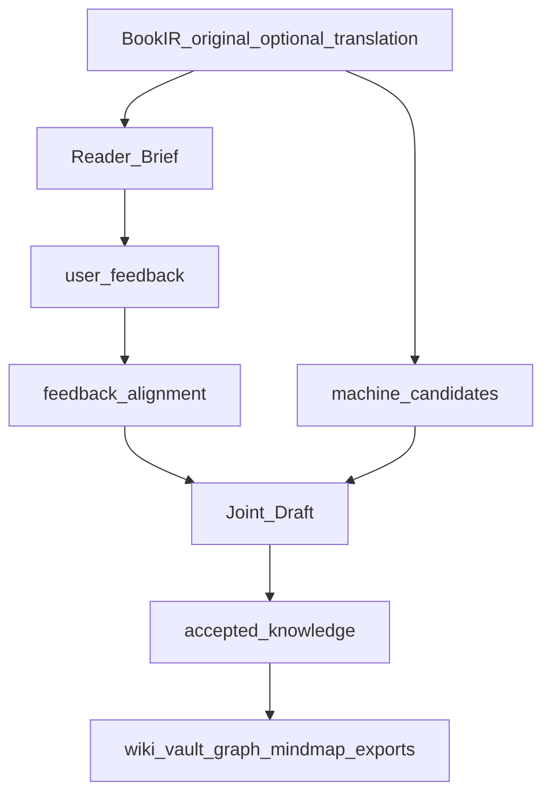

# Phase B Feedback Workflow

This note defines the user-facing Phase B workflow after BookIR exists. The core decision is that users do not review raw machine knowledge graphs. They review a readable book frame, contribute their own reading evidence and insights, then inspect a joint draft before accepted knowledge is emitted.

## User-Centered Sequence



## Feedback Entry Points

Phase B must support three user moments.

1. **Before deep reading**: the user reads `Reader Brief` and corrects book-level framing, important parts, goals, and useful external references.
2. **During reading**: the user contributes highlights, excerpts, annotation exports, chapter notes, local questions, disagreements, and link hints.
3. **After a joint draft exists**: the user confirms or corrects top-level structure, promotes important nodes, rejects clear drift, and adds missing cross-links.

The user may skip any moment. A workflow that only has imported highlights or only has a late whole-book insight must still be valid.

## Reader Brief

`Reader Brief` is the first user-facing Phase B artifact.

It should contain:

- Book identity and language mode.
- Current profile / network organization judgment in plain language.
- A part map and chapter map with high-value vs apparatus decisions.
- Short chapter cards with concise content orientation.
- Candidate top-level questions / concepts / events when available.
- A feedback prompt that accepts natural language instead of JSON edits.

It should not expose raw extracted nodes as the primary view.

## Accepted Feedback Forms

Feedback must accept non-uniform reading habits:

| Feedback kind | Example | Primary effect |
| --- | --- | --- |
| `book_frame` | "This is historical narration plus conceptual interpretation." | Adjust network organization and chapter priority. |
| `reading_goal` | "I care about ritual visibility, not publication history." | Rank nodes and exports for the user goal. |
| `highlight` | Highlighted paragraph from EPUB/PDF/reader export. | Add high-signal source passage. |
| `chapter_note` | "Chapter 3 turns the argument from symbols to institutions." | Add chapter-local user insight. |
| `concept_hint` | "These concepts matter: public memory, sensory politics." | Promote or search concepts. |
| `relation_hint` | "This links to the X node from another book." | Candidate cross-book relation. |
| `reference_material` | Review, recommendation, course note, publisher description. | Weak prior only, not accepted source evidence. |
| `disagreement` | "The author overstates this causal link." | Preserve user stance separately from source claim. |

## Knowledge Provenance States

Formal outputs must keep these states separate:

- `source_derived`: supported by book text and provenance.
- `machine_candidate`: extracted automatically, not accepted.
- `user_observed`: user insight, not yet aligned to source evidence.
- `user_supported`: user feedback aligned to source text or an accepted source-derived node.
- `accepted`: emitted into the formal knowledge layer after policy checks.

External reviews and recommendations may explain why a node matters, but they cannot replace source evidence.

## Feedback Storage

Recommended storage layout:

```text
knowledge/
  reader-brief.md
  reader-brief.html
  feedback-template.md
  feedback/
    raw/
    aligned/
  candidates/
  joint-draft.md
  joint-draft.html
  accepted/
```

`feedback/raw/` preserves the user's original input. `feedback/aligned/` records attempted links to:

- `book_id`
- `chapter_id`
- `unit_id`
- page range when available
- excerpt hash
- matched machine candidates when available

Unaligned book-level insights must remain valid feedback objects.

## Joint Draft

`Joint Draft` is the first knowledge-structure artifact meant for user inspection.

It should show:

- Current top-level organizing questions or branches.
- Concepts, claims, facts, events, cases, and procedures grouped under those branches when the profile supports them.
- What came from the book, what came from the user, and what is still a machine candidate.
- Conflicts, unresolved hints, and gaps.
- Source pointers for claims that may enter accepted knowledge.

The draft should read like a structured book knowledge memo, not like a graph database dump.

## Model Use

Models may:

- Structure natural-language feedback.
- Align highlights and notes to BookIR units.
- Merge compatible user hints and machine candidates into draft branches.
- Render readable draft prose from typed objects.

Models may not:

- Invent source support for user insights.
- Treat external reviews as accepted book evidence.
- Collapse user disagreement into the author's own claim.
- Bypass profile schema or provenance requirements.

## Next Implementation Slice

Implemented baseline:

- `book-weaver knowledge brief RUN_DIR`
- `knowledge/reader-brief.md` and `knowledge/reader-brief.html`
- `knowledge/feedback-template.md`
- `book-weaver knowledge feedback RUN_DIR --input FILE`
- Raw feedback objects plus first-pass deterministic alignment
- Feedback-level structural review that can update `plan.json`, including network-model correction, preserve/skip requests, and reference priors

Next slice:

1. `book-weaver knowledge draft RUN_DIR`
2. `knowledge/joint-draft.md` and `knowledge/joint-draft.html`
3. `book-weaver knowledge accept RUN_DIR`

Accepted knowledge and exporters come after the draft can be judged by a reader.
