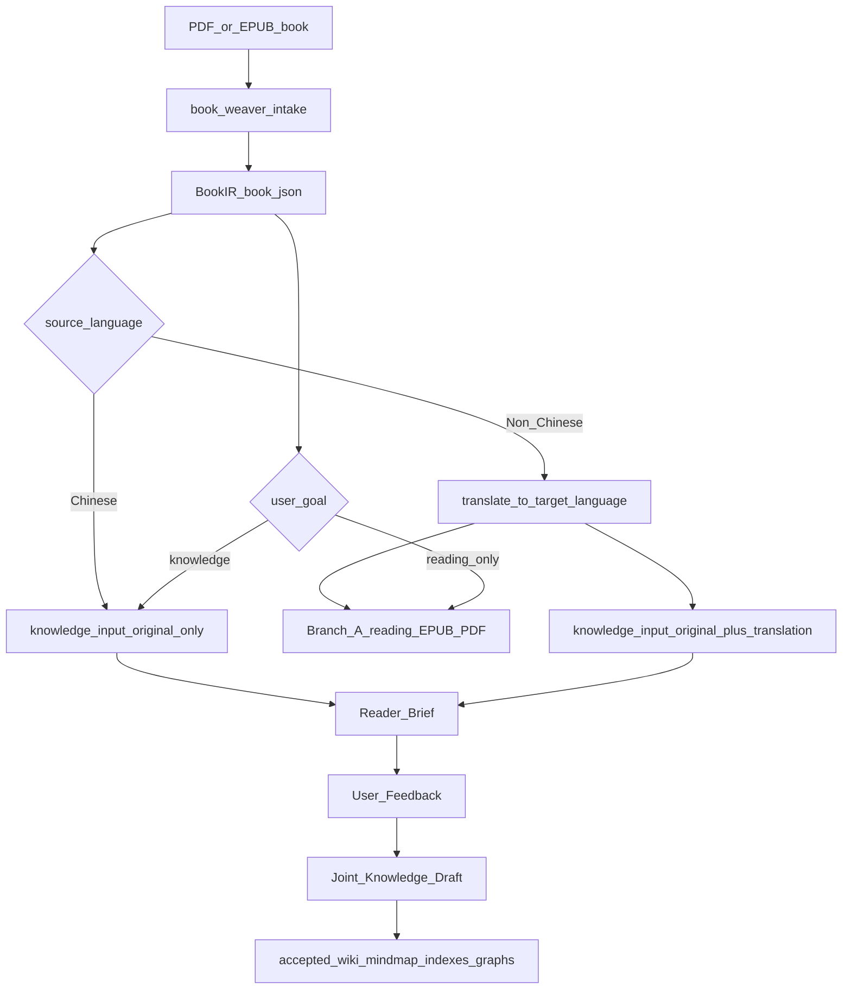
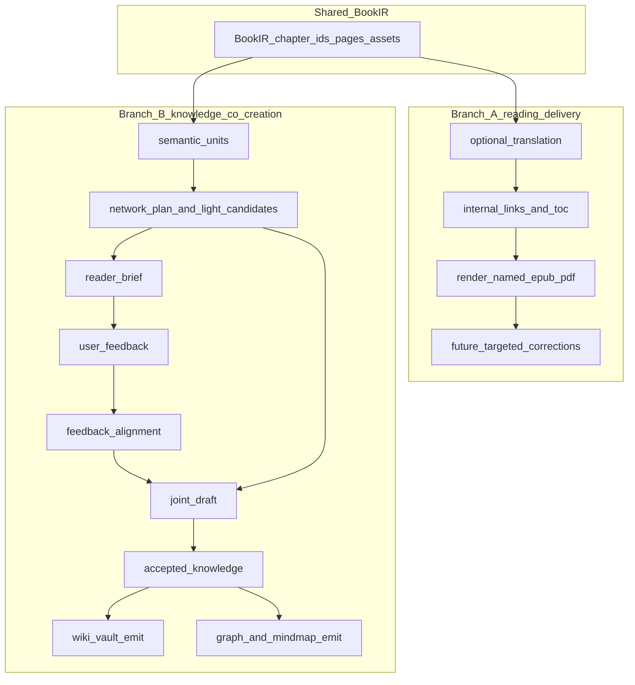

# BookWeaver 路线图：书籍输入、翻译阅读与知识网络化

本文档与仓库代码一并维护，描述 BookWeaver 从 PDF / EPUB 书籍输入到阅读交付与知识网络化的产品路线。历史讨论见仓库 Issue / PR 时可引用本文件路径：`docs/ROADMAP.md`。

BookWeaver 已从单一“PDF 翻译器”分叉为书籍处理与知识化项目。翻译仍是分支 A 的核心能力，但项目边界已经扩展为：书籍结构归一化、阅读交付、用户阅读反馈、知识拆分、知识网络和后续平台输出。

项目定位见 [`docs/PROJECT_IDENTITY.md`](./PROJECT_IDENTITY.md)。Phase B 外部方法和项目调研见 [`docs/PHASE_B_RESEARCH.md`](./PHASE_B_RESEARCH.md)。具体分阶段实施计划见 [`docs/IMPLEMENTATION_PLAN.md`](./IMPLEMENTATION_PLAN.md)。Phase A 的执行方法见 [`docs/PHASE_A_METHOD.md`](./PHASE_A_METHOD.md)。分支 A 的链接、章节 id、脚注和定点修正契约见 [`docs/BRANCH_A_CONTRACT.md`](./BRANCH_A_CONTRACT.md)。知识分支的 profile 分类与方法论见 [`docs/KNOWLEDGE_PROFILES.md`](./KNOWLEDGE_PROFILES.md)。用户反馈工作流见 [`docs/PHASE_B_FEEDBACK_WORKFLOW.md`](./PHASE_B_FEEDBACK_WORKFLOW.md)。双语知识输入契约见 [`docs/BILINGUAL_KNOWLEDGE_CONTRACT.md`](./BILINGUAL_KNOWLEDGE_CONTRACT.md)。

## 总览

系统输入是一本文档：PDF 或 EPUB。核心流程不是“先翻译再结束”，而是先把书籍变成稳定 BookIR，再根据语言和用户目标选择路径：

- 默认主线是 `book-weaver intake`：只做输入防护、结构重建、BookIR、章节报告和可检查 Markdown。
- 如果输入是英文或其他外文，翻译是 **可选语言归一化能力**，产出译文 EPUB，同时可将 **原文 + 译文** 一起作为知识分支输入。
- 英文或其他外文也可以不翻译，直接以 `source_only` 进入知识分支。
- 如果输入已经是中文，可以跳过翻译，直接进入知识分支。
- 用户可以选择只做阅读交付，不进入知识分支。

因此当前路线分为两个产品分支：

- **分支 A：阅读交付**。目标是把书翻译成可读 EPUB/PDF，并支持看样后的局部修正。
- **分支 B：知识共建与网络化管理**。目标是基于 BookIR、原文、译文、用户阅读反馈形成可读的知识草图，再生成 Wiki、脑图、索引和后续知识图谱。

两条分支 **共用同一套章节边界、章节 id、页码、图表和来源追溯契约**，避免翻译阅读和知识提炼各自重建结构。

### 主流程



### 分章原则（已确认）

- **按内容分章**：边界反映 **原文/原书的逻辑结构**（目录、卷、篇、章标题层级等），**不以 PDF 页码或物理页** 做主切片。
- **工程信号**：优先 **EPUB spine / NCX / 标题块**（及 PDF 管线中等价结构节点）；页级启发式仅兜底，不主导主叙事章界。
- **双语对齐**：外文书进入知识分支时，知识单元需要同时保留原文和译文引用；中文书只保留单语来源。



---

## 主线：书籍摄入与 BookIR

**目标**：对每本可支持的 PDF / EPUB，先生成稳定、可追溯、可复用的 `book.json` 和章节资产，不以翻译作为前置条件。

当前命令：

```bash
book-weaver intake SOURCE --profile book
```

主线产物：

- `book.json`
- `book.md`
- `book-trace.md`
- `chapter-report.json`
- `book-images/`
- `manifest.json`

## 分支 A：阅读交付（可选翻译 EPUB/PDF）

**目标**：当用户需要阅读译本时，产出可读 EPUB/PDF。外文书可翻译；中文书跳过翻译或直接使用原文阅读版。分支 A 可以作为最终交付，也可以作为分支 B 的语言归一化步骤。

### 代码落点

| 环节 | 模块 | 说明 |
|------|------|------|
| EPUB ingest | [`src/pdf_translator/ingest.py`](../src/pdf_translator/ingest.py) | 行内 `<a href>` → Markdown；`source_internal_path` 写入 `_epub_meta["chapters"]` |
| 书稿 IR | [`src/pdf_translator/book_rebuild.py`](../src/pdf_translator/book_rebuild.py) | EPUB 章节透传 `source_internal_path` |
| 翻译 | [`src/pdf_translator/translate.py`](../src/pdf_translator/translate.py) | `TranslatedChapter.source_internal_path` |
| 输出 EPUB | [`src/pdf_translator/epub.py`](../src/pdf_translator/epub.py) | 命名 EPUB、内部链接重写、保留图表/附属内容 |

### 已实现（L1 + L2 基线）

- 交付 EPUB/PDF 使用源书名和目标语言命名，不再固定为 `translated.epub`。
- **L1**：正文/列表/引用/标题中的链接与 `<sup>` 内链接进入 Markdown；包内 href 规范为 zip 内 posix 路径 + 可选 fragment。
- **L2**：渲染前将仍指向源 spine 文件的 `<a href>` 重写为输出包内 **同目录章节文件名 + fragment**。
- 翻译缓存、并发和 polish 已形成可复用基础。

### 待办（分支 A）

1. **链接契约**：必须支持的范围（外链 / 脚注 / 任意 `xhtml#`）与译后 **id 冻结 vs 重映射表** 的书面约定。
2. **章节 IR**：与 `book_ir` 对齐的稳定 `chapter_id` / slug 策略（与分章原则一致）。
3. **L3（可选）**：脚注/尾注双向；与 `metadata["footnote_line_ratio"]` / `footnote_load` 专轨协同，避免单书过拟合正则。
4. **验收**：合成 EPUB 上自动统计 **可解析 href 比例**（回归指标，不绑单本样书）。
5. **L4**：PDF 内链依赖 Docling（或替代管线）链接导出，单独评估上限。
6. **看样后定点修正（TODO）**：用户初步阅读 EPUB 后，可指定章节 / 段落 / 句子位置提交修正要求；系统只重跑对应 `chapter_id` / 文本片段，更新 `translated.md`、EPUB 章节 XHTML 与修正记录，不重新翻译整本书。

---

## 分支 B：知识共建与网络化管理（下一阶段）

**目标**：从 BookIR、原文和可选译文出发，先给用户一份可读的阅读框架，再吸收用户的划线、章节洞察、书评参考和全书判断，形成可追溯的人机共识草图，最后生成可管理、可进一步加工的知识资产。

分支 B 的输入分两种：

- 中文书：`book.json + book.md`。
- 外文书：`book.json + book.md + translated.md + translated_chapters`，知识单元保留原文和译文双引用。

### 分支 B 的阶段

1. **确定性结构层**：生成 `knowledge/chapters.json`、`knowledge/semantic-units.json` 和双语/单语输入契约，不调用模型。
2. **阅读框架层**：生成 `Reader Brief`，用结构地图、章节卡片和当前组织判断帮助用户进入这本书，而不是直接给用户机器图谱。
3. **用户反馈层**：接收一次性框架判断、阅读标注、章节洞察、全书洞察和外部参考材料；保留原始反馈，并尽量对齐到 `chapter_id` / `unit_id`。
4. **机器候选层**：按 [`docs/KNOWLEDGE_PROFILES.md`](./KNOWLEDGE_PROFILES.md) 生成 profile-specific candidates；候选知识不能直接作为正式网络。
5. **人机共识草图层**：把用户反馈和机器候选融合为可读 `Joint Draft`，显示主问题、概念、主张、事实/案例、冲突、遗漏和来源。
6. **正式知识层**：在草图确认后生成 accepted nodes / edges / quality report。
7. **输出层**：Wiki / Markdown vault、索引、Mermaid 脑图、JSON graph，后续再接 Notion / Obsidian / Neo4j。

### 分支 B 的命令序列

```bash
book-weaver knowledge build RUN_DIR
book-weaver knowledge metadata RUN_DIR
book-weaver knowledge plan RUN_DIR
book-weaver knowledge brief RUN_DIR
book-weaver knowledge feedback RUN_DIR --input feedback.md
book-weaver knowledge extract RUN_DIR --network-model argument_network
book-weaver knowledge draft RUN_DIR
book-weaver knowledge accept RUN_DIR
book-weaver knowledge export RUN_DIR --format markdown-vault
```

`book-weaver knowledge build RUN_DIR` 已实现为 Phase B Core 的确定性起点。它消费 `book-weaver intake` 或 `book-weaver translate` 产生的 run 目录，不调用模型，默认写入 `RUN_DIR/knowledge/`：

- `manifest.json`
- `chapters.json`
- `semantic-units.json`
- `bilingual-input.json`
- `assets.json`
- `source-map.json`

译文只有在可安全按章节和段落对齐时才进入 `semantic-units.json`；无法对齐时保留原文单元，并在 `bilingual-input.json` 保留章节级译文，不强行错配。

`book-weaver knowledge suitability RUN_DIR` 已实现为规则版适用性报告。它可以继续作为诊断视图，但它不再是用户进入 Phase B 的主界面。默认写入：

- `knowledge/suitability-report.json`
- `knowledge/suitability.md`

它会判断 profile、网络化适用性、推荐输出、可抽取对象、风险和逐章处理动作。后续 `Reader Brief` 应吸收这些信号，并把它们改写成用户可读的阅读框架。

`book-weaver knowledge plan RUN_DIR` 已实现为真正的网络组织计划器。当前版本是规则版，不调用模型，默认写入：

- `knowledge/plan-candidates.json`
- `knowledge/plan.json`
- `knowledge/plan.md`

它不会只判断“书籍类型”，而是选择知识网络组织模型：

- `argument_network`
- `concept_network`
- `event_timeline_network`
- `playbook_network`
- `narrative_network`
- `faceted_index_network`

`plan.md` 是工程检查物，不是用户反馈界面。它必须说明主网络模型、二级分支模板、候选顶层节点、逐章角色、抽取对象和质量门槛。面向用户的首个反馈界面应改为 `Reader Brief`。模型仲裁层预留在 `plan.json.planner` 中，后续可加入 MiniMax 等低成本模型，但模型不能绕过 schema 或直接成为最终图谱。

`book-weaver knowledge metadata RUN_DIR` 已实现为外部 metadata prior。它会搜索公开书籍元数据，并生成：

- `knowledge/metadata-prior.json`
- `knowledge/metadata-prior.md`

`book-weaver knowledge plan RUN_DIR --metadata-prior auto` 会读取或自动生成该先验，并将其作为弱信号加入网络模型评分。策略是 **metadata 只加权，不覆盖本地结构证据**。如果外部 API 失败，系统仍会用书名/文件名生成低权重先验，并继续本地 plan。

`book-weaver knowledge feedback RUN_DIR --input feedback.md` 已吸收早期 `knowledge review` 的一次性结构确认语义。用户不编辑 JSON 或系统中间文档，只提供自然语言反馈，内容可包括：

- 组织方式确认：如 `event_timeline_network + concept_network`。
- 必须保留的内容类型：如 `appendix`、`glossary`、`chronology`、`illustrations`、`tables`。
- 可以跳过的内容类型：如 `copyright`、`index`、`publisher pages`。
- 用户提供的参考材料：书评、推荐语、出版社简介、课程 reading note、URL 或粘贴文本。

输出：

- `knowledge/feedback/raw/*.json`
- `knowledge/feedback/aligned/*.json`
- `knowledge/user-review.json`
- `knowledge/reference-prior.json`（如果用户提供参考材料）
- 更新后的 `knowledge/plan.json`
- 更新后的 `knowledge/plan.md`

`book-weaver knowledge review RUN_DIR --answers answers.txt` 可保留为兼容入口，但产品主线应使用 `brief -> feedback -> draft`。

用户参考材料只作为 `reference_prior`，不能直接生成 accepted knowledge。后续融合仍必须区分书中证据、用户洞察和外部参考。

`book-weaver knowledge extract RUN_DIR --network-model argument_network` 已实现第一版 profile-specific 候选抽取闭环。当前只支持 `argument_network`：

- 输出 `knowledge/extracted-nodes.json`
- 输出 `knowledge/extracted-edges.json`
- 输出 `knowledge/extraction-report.md`
- 节点类型：`question`、`claim`、`evidence`、`concept`
- 关系类型：`develops`、`supports`、`uses_concept`
- 每个节点和边都保留 `chapter_id`、`unit_id`、页码、原文 hash 等 provenance
- 输出属于 `machine_candidate`，应进入 `Joint Draft`，不能直接要求用户逐节点审查

其他 network model 当前会生成明确的 unsupported 报告，而不是套用论证抽取器。这样可以防止把同一种算法错误应用到历史、实用手册、叙事或技术类书籍。

### 分支 B 的关键约束

- 不同书类不能共用同一套知识 schema。
- 知识点必须带 provenance；没有来源的模型总结不能进入正式网络。
- 用户不直接审查机器候选图谱；用户首先看到 `Reader Brief`，随后审查 `Joint Draft`。
- 自动抽取是候选层；用户划线、章节洞察和全书判断是独立反馈层，二者融合后才进入 accepted knowledge。
- 正式网络必须区分 `source_derived`、`user_observed`、`user_supported`、`machine_candidate`、`accepted`。
- 外文书的知识化应同时利用原文和译文：译文提高可读性，原文保留术语和证据精度。

---

## 附录：内部链接复杂度分层（准确度预期）

| 层级 | 内容 | 说明 |
|------|------|------|
| **L0** | 外链 `https://…` | 依赖网络；翻译层需尽量保留 URL 字面量。 |
| **L1** | 正文保留 `[text](url)` | EPUB 已实现基线；仍可能指向 **原** 包路径直至 L2。 |
| **L2** | 原 spine 路径 → 新 `chapters/NNN-slug.xhtml` | 输出 EPUB 已实现映射重写；合并/重切片时映射复杂度上升。 |
| **L3** | 脚注/尾注双向与稳定 fragment | 与脚注专轨强相关。 |
| **L4** | PDF 内链 | 受引擎导出能力限制。 |

**策略**：先定契约 → L1 → L2（合成 EPUB 测）→ L3 与脚注 metadata 协同 → 用 **可解析 href 比例** 做回归，避免单本肉眼验收。

---

## 跟踪项（可与 Issue 对齐）

- [x] 主流程：不翻译的 `book-weaver intake` 入口
- [x] 主流程：`book-weaver finalize` 生成 `phase_a_status.json`
- [x] 主流程：`book-weaver cleanup --dry-run` 清理临时产物
- [ ] 主流程：语言判断 + 用户目标选择（只 intake / 翻译阅读 / 翻译后知识化 / 中文直接知识化）
- [x] 主流程：双语 BookIR / knowledge input contract
- [x] 主流程：`phase_a_status_v2` 支持 source-only 与 approved reviewed translation 路由
- [x] 分支 A：机器预审、逐段重写请求、版本化审阅导出
- [x] 分支 B：`argument_network` 第一版 profile-specific extraction
- [ ] 分支 A：链接契约 + 译后 id 策略定稿  
- [ ] 分支 A：章节 IR 与 `book_ir` 单一事实源整理  
- [ ] 分支 A：合成 EPUB href 可解析比例自动化校验  
- [ ] 分支 A（可选）：L3 脚注与 `footnote_load` 协同  
- [ ] 分支 A（TODO）：看样后定点修正 schema、定位方式与最小重渲染流程  
- [x] 分支 B：`knowledge/chapters.json` 与 `knowledge/semantic-units.json`
- [x] 分支 B：`suitability-report.json` + network plan / metadata prior / feedback-level structural review
- [x] 分支 B：`Reader Brief` + feedback template + feedback ingest
- [x] 分支 B：反馈对齐到 `chapter_id` / `unit_id`，并保留无法局部定位的全书洞察
- [ ] 分支 B：`Joint Draft` 可读草图，将用户反馈与机器候选并列/融合
- [ ] 分支 B：accepted knowledge 层与 quality report
- [ ] 分支 B：Markdown vault / Wiki / 脑图 / graph exporter
- [ ] 分支 B：按 profile 扩展 extractor，下一优先级为 `event_timeline_network`
