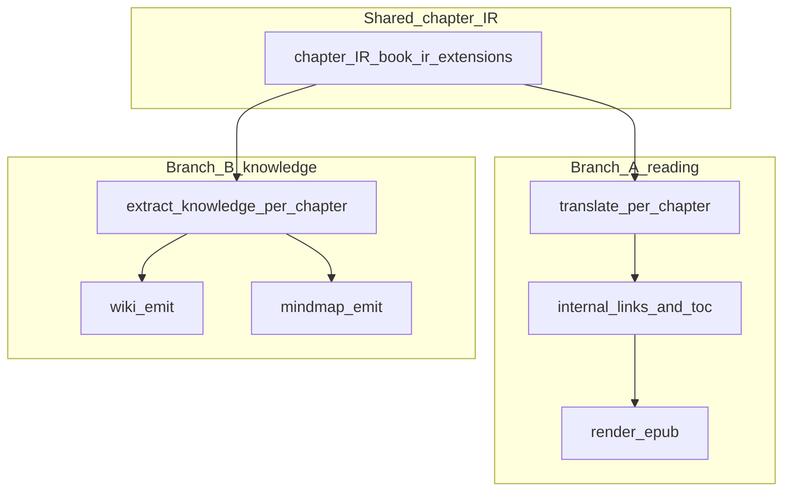

# 路线图：高分章节、分支 A / B 与内部链接

本文档与仓库代码一并维护，描述产品阶段划分与分支 A（翻译 + 译后跳转）的技术分层。历史讨论见仓库 Issue / PR 时可引用本文件路径：`docs/ROADMAP.md`。

## 总览

工程从「能跑通 ingest → 书稿 → EPUB」进入 **更高要求的分章节**：章节既是 **翻译与阅读导航** 的单元，也是 **知识提炼** 的单元。两条分支 **共用同一套章节边界与章节 id 契约**，避免两套分章逻辑漂移。

### 分章原则（已确认）

- **按内容分章**：边界反映 **原文/原书的逻辑结构**（目录、卷、篇、章标题层级等），**不以 PDF 页码或物理页** 做主切片。
- **工程信号**：优先 **EPUB spine / NCX / 标题块**（及 PDF 管线中等价结构节点）；页级启发式仅兜底，不主导主叙事章界。

---

## 分支 A：翻译 + 译后章节跳转（当前优先）

**目标**：译稿 EPUB 中 **按章阅读**，且 **章内/章间跳转**（脚注、参见、目录锚点等）在可接受准确度内可用。

### 代码落点

| 环节 | 模块 | 说明 |
|------|------|------|
| EPUB ingest | [`src/pdf_translator/ingest.py`](../src/pdf_translator/ingest.py) | 行内 `<a href>` → Markdown；`source_internal_path` 写入 `_epub_meta["chapters"]` |
| 书稿 IR | [`src/pdf_translator/book_rebuild.py`](../src/pdf_translator/book_rebuild.py) | EPUB 章节透传 `source_internal_path` |
| 翻译 | [`src/pdf_translator/translate.py`](../src/pdf_translator/translate.py) | `TranslatedChapter.source_internal_path` |
| 输出 EPUB | [`src/pdf_translator/epub.py`](../src/pdf_translator/epub.py) | `build_epub_internal_href_map` + `rewrite_epub_internal_hrefs`（L2） |

### 已实现（L1 + L2 基线）

- **L1**：正文/列表/引用/标题中的链接与 `` 内链接进入 Markdown；包内 href 规范为 zip 内 posix 路径 + 可选 fragment。
- **L2**：渲染前将仍指向源 spine 文件的 `<a href>` 重写为输出包内 **同目录章节文件名 + fragment**。

### 待办（分支 A）

1. **链接契约**：必须支持的范围（外链 / 脚注 / 任意 `xhtml#`）与译后 **id 冻结 vs 重映射表** 的书面约定。
2. **章节 IR**：与 `book_ir` 对齐的稳定 `chapter_id` / slug 策略（与分章原则一致）。
3. **L3（可选）**：脚注/尾注双向；与 `metadata["footnote_line_ratio"]` / `footnote_load` 专轨协同，避免单书过拟合正则。
4. **验收**：合成 EPUB 上自动统计 **可解析 href 比例**（回归指标，不绑单本样书）。
5. **L4**：PDF 内链依赖 Docling（或替代管线）链接导出，单独评估上限。

---

## 分支 B：分章 → 提炼 → Wiki / 脑图（后续）

在 **同一章节 IR** 上做按章知识点提炼，产出 Wiki 与脑图。工程上与分支 A 渲染可分离；占位 CLI：`pdf-translator knowledge wiki-outline` / `mindmap`（见 [`src/pdf_translator/knowledge.py`](../src/pdf_translator/knowledge.py)）。

---

## 附录：内部链接复杂度分层（准确度预期）

| 层级 | 内容 | 说明 |
|------|------|------|
| **L0** | 外链 `https://…` | 依赖网络；翻译层需尽量保留 URL 字面量。 |
| **L1** | 正文保留 `[text](url)` | EPUB 已实现基线；仍可能指向 **原** 包路径直至 L2。 |
| **L2** | 原 spine 路径 → 新 `chapters/NNN-slug.xhtml` | 输出 EPUB 已实现映射重写；合并/重切片时映射复杂度上升。 |
| **L3** | 脚注/尾注双向与稳定 fragment | 与脚注专轨强相关。 |
| **L4** | PDF 内链 | 受引擎导出能力限制。 |

**策略**：先定契约 → L1 → L2（合成 EPUB 测）→ L3 与脚注 metadata 协同 → 用 **可解析 href 比例** 做回归，避免单本肉眼验收。

---

## 跟踪项（可与 Issue 对齐）

- [ ] 分支 A：链接契约 + 译后 id 策略定稿  
- [ ] 分支 A：章节 IR 与 `book_ir` 单一事实源整理  
- [ ] 分支 A：合成 EPUB href 可解析比例自动化校验  
- [ ] 分支 A（可选）：L3 脚注与 `footnote_load` 协同  
- [ ] 分支 B：内容分章与章节 IR 共用确认  
- [ ] 分支 B：按章提炼 schema + Wiki / 脑图正式管线  
