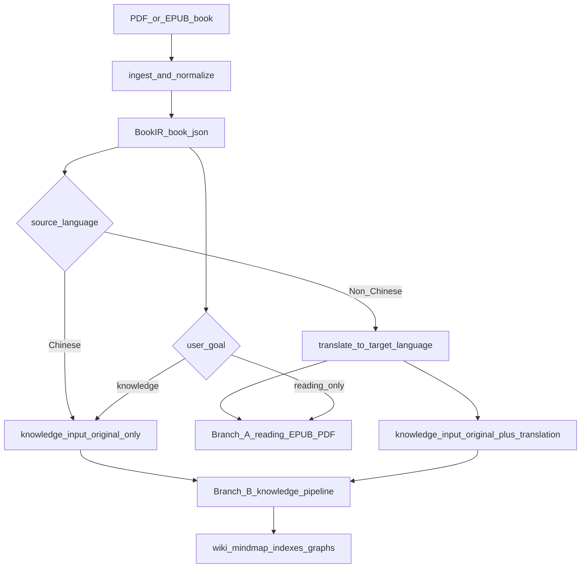
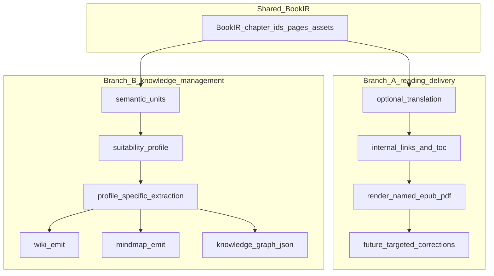

# BookWeaver 路线图：书籍输入、翻译阅读与知识网络化

本文档与仓库代码一并维护，描述 BookWeaver 从 PDF / EPUB 书籍输入到阅读交付与知识网络化的产品路线。历史讨论见仓库 Issue / PR 时可引用本文件路径：`docs/ROADMAP.md`。

BookWeaver 已从单一“PDF 翻译器”分叉为书籍处理与知识化项目。翻译仍是分支 A 的核心能力，但项目边界已经扩展为：书籍结构归一化、阅读交付、知识拆分、知识网络和后续平台输出。

项目定位见 [`docs/PROJECT_IDENTITY.md`](./PROJECT_IDENTITY.md)。具体分阶段实施计划见 [`docs/IMPLEMENTATION_PLAN.md`](./IMPLEMENTATION_PLAN.md)。Phase A 的执行方法见 [`docs/PHASE_A_METHOD.md`](./PHASE_A_METHOD.md)。分支 A 的链接、章节 id、脚注和定点修正契约见 [`docs/BRANCH_A_CONTRACT.md`](./BRANCH_A_CONTRACT.md)。知识分支的 profile 分类与方法论见 [`docs/KNOWLEDGE_PROFILES.md`](./KNOWLEDGE_PROFILES.md)。

## 总览

系统输入是一本文档：PDF 或 EPUB。核心流程不是“先翻译再结束”，而是先把书籍变成稳定 BookIR，再根据语言和用户目标选择路径：

- 如果输入是英文或其他外文，翻译是 **语言归一化前置能力**，产出译文 EPUB，同时将 **原文 + 译文** 一起作为知识分支输入。
- 如果输入已经是中文，可以跳过翻译，直接进入知识分支。
- 用户可以选择只做阅读交付，不进入知识分支。

因此当前路线分为两个产品分支：

- **分支 A：阅读交付**。目标是把书翻译成可读 EPUB/PDF，并支持看样后的局部修正。
- **分支 B：知识拆分与网络化管理**。目标是基于 BookIR、原文、译文生成章节化知识资产、Wiki、脑图、索引和后续知识图谱。

两条分支 **共用同一套章节边界、章节 id、页码、图表和来源追溯契约**，避免翻译阅读和知识提炼各自重建结构。

### 主流程



### 分章原则（已确认）

- **按内容分章**：边界反映 **原文/原书的逻辑结构**（目录、卷、篇、章标题层级等），**不以 PDF 页码或物理页** 做主切片。
- **工程信号**：优先 **EPUB spine / NCX / 标题块**（及 PDF 管线中等价结构节点）；页级启发式仅兜底，不主导主叙事章界。
- **双语对齐**：外文书进入知识分支时，知识单元需要同时保留原文和译文引用；中文书只保留单语来源。



---

## 分支 A：阅读交付（翻译 EPUB/PDF）

**目标**：当用户需要阅读译本时，产出可读 EPUB/PDF。外文书默认翻译；中文书通常跳过。分支 A 可以作为最终交付，也可以作为分支 B 的前置语言归一化步骤。

### 代码落点

| 环节 | 模块 | 说明 |
|------|------|------|
| EPUB ingest | [`src/pdf_translator/ingest.py`](../src/pdf_translator/ingest.py) | 行内 `<a href>` → Markdown；`source_internal_path` 写入 `_epub_meta["chapters"]` |
| 书稿 IR | [`src/pdf_translator/book_rebuild.py`](../src/pdf_translator/book_rebuild.py) | EPUB 章节透传 `source_internal_path` |
| 翻译 | [`src/pdf_translator/translate.py`](../src/pdf_translator/translate.py) | `TranslatedChapter.source_internal_path` |
| 输出 EPUB | [`src/pdf_translator/epub.py`](../src/pdf_translator/epub.py) | 命名 EPUB、内部链接重写、保留图表/附属内容 |

### 已实现（L1 + L2 基线）

- 交付 EPUB/PDF 使用源书名和目标语言命名，不再固定为 `translated.epub`。
- **L1**：正文/列表/引用/标题中的链接与 `<sup>` 内链接进入 Markdown；包内 href 规范为 zip 内 posix 路径 + 可选 fragment。
- **L2**：渲染前将仍指向源 spine 文件的 `<a href>` 重写为输出包内 **同目录章节文件名 + fragment**。
- 翻译缓存、并发和 polish 已形成可复用基础。

### 待办（分支 A）

1. **链接契约**：必须支持的范围（外链 / 脚注 / 任意 `xhtml#`）与译后 **id 冻结 vs 重映射表** 的书面约定。
2. **章节 IR**：与 `book_ir` 对齐的稳定 `chapter_id` / slug 策略（与分章原则一致）。
3. **L3（可选）**：脚注/尾注双向；与 `metadata["footnote_line_ratio"]` / `footnote_load` 专轨协同，避免单书过拟合正则。
4. **验收**：合成 EPUB 上自动统计 **可解析 href 比例**（回归指标，不绑单本样书）。
5. **L4**：PDF 内链依赖 Docling（或替代管线）链接导出，单独评估上限。
6. **看样后定点修正（TODO）**：用户初步阅读 EPUB 后，可指定章节 / 段落 / 句子位置提交修正要求；系统只重跑对应 `chapter_id` / 文本片段，更新 `translated.md`、EPUB 章节 XHTML 与修正记录，不重新翻译整本书。

---

## 分支 B：知识拆分与网络化管理（下一阶段）

**目标**：从 BookIR、原文和可选译文出发，把一本书拆解成可管理、可追溯、可进一步加工的知识资产。

分支 B 的输入分两种：

- 中文书：`book.json + book.md`。
- 外文书：`book.json + book.md + translated.md + translated_chapters`，知识单元保留原文和译文双引用。

### 分支 B 的阶段

1. **确定性结构层**：生成 `knowledge/chapters.json` 和 `knowledge/semantic-units.json`，不调用模型。
2. **适用性判断**：生成 `knowledge/suitability-report.json`，判断书类 profile、可行输出、风险和是否值得网络化。
3. **profile-specific extraction**：按 [`docs/KNOWLEDGE_PROFILES.md`](./KNOWLEDGE_PROFILES.md) 选择抽取 schema。
4. **归一化与合并**：概念、人物、术语、别名、译名、重复 claim 合并。
5. **输出层**：Wiki、索引、Mermaid 脑图、JSON graph，后续再接 Notion / Obsidian / Neo4j。

### 分支 B 的第一批命令建议

```bash
book-weaver knowledge build RUN_DIR
book-weaver knowledge suitability RUN_DIR
book-weaver knowledge extract RUN_DIR --profile argumentative
```

### 分支 B 的关键约束

- 不同书类不能共用同一套知识 schema。
- 知识点必须带 provenance；没有来源的模型总结不能进入正式网络。
- 自动抽取是候选层，后续需要支持人工修正和回写。
- 外文书的知识化应同时利用原文和译文：译文提高可读性，原文保留术语和证据精度。

---

## 附录：内部链接复杂度分层（准确度预期）

| 层级 | 内容 | 说明 |
|------|------|------|
| **L0** | 外链 `https://…` | 依赖网络；翻译层需尽量保留 URL 字面量。 |
| **L1** | 正文保留 `[text](url)` | EPUB 已实现基线；仍可能指向 **原** 包路径直至 L2。 |
| **L2** | 原 spine 路径 → 新 `chapters/NNN-slug.xhtml` | 输出 EPUB 已实现映射重写；合并/重切片时映射复杂度上升。 |
| **L3** | 脚注/尾注双向与稳定 fragment | 与脚注专轨强相关。 |
| **L4** | PDF 内链 | 受引擎导出能力限制。 |

**策略**：先定契约 → L1 → L2（合成 EPUB 测）→ L3 与脚注 metadata 协同 → 用 **可解析 href 比例** 做回归，避免单本肉眼验收。

---

## 跟踪项（可与 Issue 对齐）

- [ ] 主流程：语言判断 + 用户目标选择（只翻译 / 翻译后知识化 / 中文直接知识化）  
- [ ] 主流程：双语 BookIR / knowledge input contract  
- [ ] 分支 A：链接契约 + 译后 id 策略定稿  
- [ ] 分支 A：章节 IR 与 `book_ir` 单一事实源整理  
- [ ] 分支 A：合成 EPUB href 可解析比例自动化校验  
- [ ] 分支 A（可选）：L3 脚注与 `footnote_load` 协同  
- [ ] 分支 A（TODO）：看样后定点修正 schema、定位方式与最小重渲染流程  
- [ ] 分支 B：`knowledge/chapters.json` 与 `knowledge/semantic-units.json`  
- [ ] 分支 B：`suitability-report.json` + profile override  
- [ ] 分支 B：按 profile 的抽取 schema + Wiki / 脑图正式管线  
